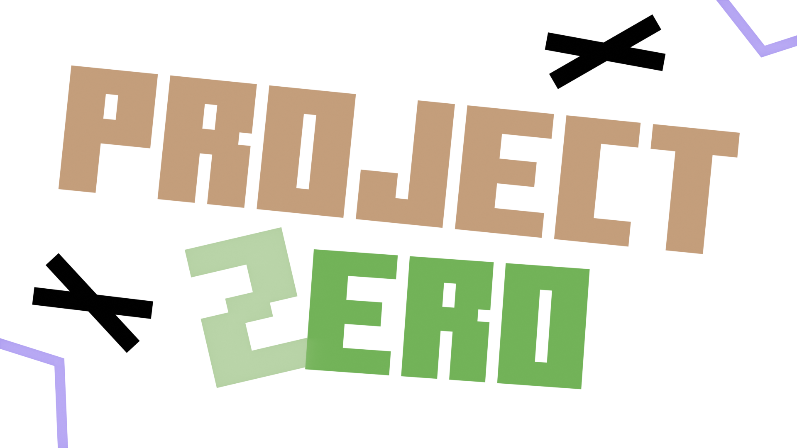

# О проекте

Основная информация:

<figure><figcaption></figcaption></figure>

ProJect Zero - наш проект который входит в тематику "шутер" или "тактическая игра" , наш проект сделан для командной игры , то есть только на мультиплеер!\
\
Режимы в проекте:\
\- Выживание (вы в открытом мире , добываете ресурсы и ведете контактирование между игроками)\
\- Тактический режим (по типу cs2 , тут вы сможете постреляться с друзьями)
